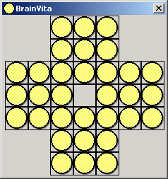



## A 8 Lines Only Code :Brainvita game

### Description

Demonstrates the effective use of Index property (conrol array: a most useful feature available in VB often ignored by many) and Drag and Drop
 
### More Info
 
This code uses effectively the Control array concept of VB.

             |
---                |---
**Submitted On**   |2006-09-09 14:34:18
**By**             |[Sachin Chavan](https://github.com/Planet-Source-Code/PSCIndex/blob/master/ByAuthor/sachin-chavan.md)
**Level**          |Advanced
**User Rating**    |5.0 (15 globes from 3 users)
**Compatibility**  |VB 5\.0, VB 6\.0
**Category**       |[Miscellaneous](https://github.com/Planet-Source-Code/PSCIndex/blob/master/ByCategory/miscellaneous__1-1.md)
**World**          |[Visual Basic](https://github.com/Planet-Source-Code/PSCIndex/blob/master/ByWorld/visual-basic.md)
**Archive File**   |[A\_8\_Lines\_2019179112006\.zip](https://github.com/Planet-Source-Code/sachin-chavan-a-8-lines-only-code-brainvita-game__1-66525/archive/master.zip)

